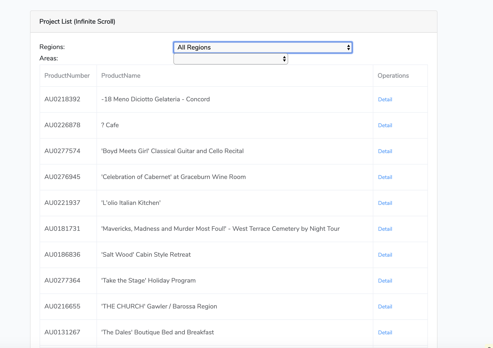
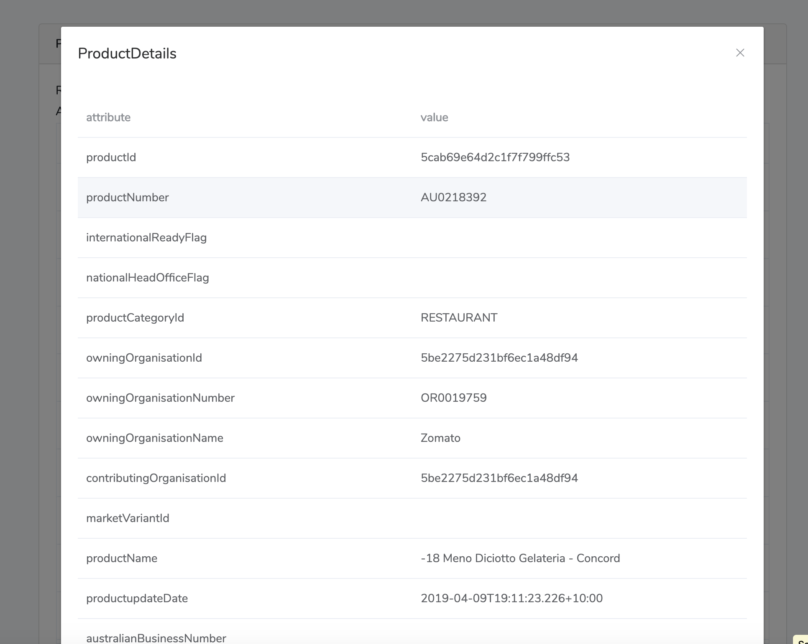

# Docker
For quick development, the Docker [Bitnami Laravel Development Container](https://github.com/bitnami/bitnami-docker-laravel) is used in the project.

# Local workspace
- Clone the repository
```
$ git clone https://github.com/railsgem/laravel-vue-atdw-data.git
$ cd laravel-vue-atdw-data
$ cp -r .env.example .env 
```

- Then update the **ATLAS_API_KEY** in .env file, the test api key which was provided in the test documentation.

- Finally launch the Laravel application development environment using:
```
$ docker-compose up
$ docker-compose exec myapp php artisan key:generate
$ docker-compose exec myapp php artisan config:cache
$ docker-compose exec myapp npm install
$ docker-compose exec myapp npm run dev
```

> ## Note

> If the application directory contained the source code of an existing Laravel application, the Bitnami Laravel Development Container would load the existing application instead of bootstrapping a new one.

After the artisan application server has been launched in the myapp service, visit http://localhost:3000 in your favorite web browser and you'll be greeted by the default Laravel welcome page.

# Executing commands

The general structure of the exec command is:

```
$ docker-compose exec <service> <command>
```
List all artisan commands:
```
$ docker-compose exec myapp php artisan list
```

# Reinitialize:
Delete the file /tmp/initialized.sem and restart the container to reinitialize
```
$ docker-compose exec myapp rm -r  /tmp/initialized.sem
```


# ScreenShots





# User Documentation

## 1. Filters
By changing the Regions or Areas, the table will automatically refresh with the selection.

## 2. Product Details
Clicking the details, the pop up dialog will show the product details in a list of attribute / value pair.

## 3. Infinity scroll
User are able to scroll up to load a new page.

## 4. Content order is randomised
Then content order is randomised by passing the random seed `rand_YYYY-MM-DD`.

## 5. Cache (Not implemented)
